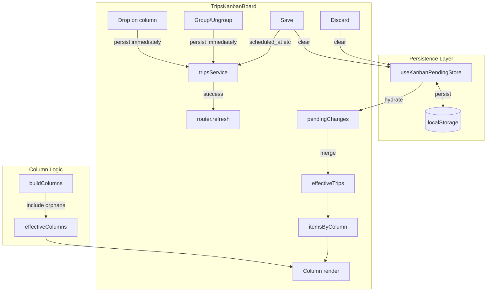

# Kanban Reliability and Data Loss Prevention

## Root Cause Analysis

### Bug 1: Pending assignments lost on navigation

- **Cause**: `pendingChanges` lives in React state; when the user switches view (Kanban → Liste via [TripsViewToggle](src/features/trips/components/trips-view-toggle.tsx)), navigates away, or refreshes, `TripsKanbanBoard` unmounts and all state is lost.
- **Trigger**: `router.push(pathname + '?' + createQueryString('view', 'list'))` causes a full navigation; the conditional `{view === 'kanban' && <TripsKanbanBoard ... />}` in [trips-listing.tsx](src/features/trips/components/trips-listing.tsx) unmounts the board.

### Bug 2: Cards disappearing

- **Cause A – Orphan columns**: `buildItemsByColumn` assigns trips to column buckets by `driver_id`/`status`/`payer_id`. `buildColumns` only creates columns for drivers in `useTripFormData()`, the fixed status list, or payers with `payer?.name`. Trips in buckets without a matching rendered column are never displayed (e.g. when drivers are still loading and `drivers = []`, all assigned trips vanish).
- **Cause B – DnD edge cases**: No `DragOverlay` is used. dnd-kit drags the real DOM node; with zoom, scroll, and nested droppables, transforms and collision detection can glitch, causing cards to appear “lost”.

### Bug 3: Assignment status lost when grouping and ungrouping

- **Cause**: The `onUngroup` handler removes `group_id` and `stop_order` from `pendingChanges` and calls `router.refresh()`. Several scenarios can cause assignment loss:
  - **Unsaved group + DB mismatch**: If the group was created in this session (never saved), the DB has no rows with that `group_id`. The `.eq('group_id', groupId)` update affects 0 rows. `router.refresh()` then returns trips with stale DB data; combined with how we merge/clear pending changes, assignments (driver/status/payer) that existed only in pending can be lost.
  - **Over-aggressive cleanup**: When destructuring `const { group_id, stop_order, ...rest } = current`, if `current` is missing expected keys due to timing or merge order, `rest` may omit `driver_id`/`status`/`payer_id`. We then set `next[id] = rest` or `delete next[id]`, potentially dropping assignment fields.
  - **Refresh before state commit**: `setPendingChanges` is asynchronous; `router.refresh()` triggers an async server fetch. In rare cases, new `trips` can arrive before the pending-change update is fully applied, leading to a render that loses unsaved assignment overrides.
- **Fix direction**: **Persist on drop** for assignments and grouping, so there are no unsaved assignment/group changes to lose. Smart rule: any drop that changes the grouped field (driver/status/payer) or grouping (group_id, stop_order) is persisted immediately. No hardcoded column checks.

---

## Recommended Solutions

### 1. Persist pending changes (Bug 1) + Smart persist-on-drop (Bug 3)

**Two-pronged approach:**

**A. Persist on drop for assignments and grouping** (fixes Bug 3, reduces Bug 1 impact)

- **Rule**: Any drop that changes the grouped field (driver/status/payer) or grouping (group_id, stop_order) triggers an immediate API call. No hardcoded column IDs.
- **Driver**: Drop on any column (including "Nicht zugewiesen") → map column id to `driver_id` (null for unassigned), persist.
- **Status**: Drop on any column → persist `status`.
- **Payer**: Drop on any column → map to `payer_id` (null for no_payer), persist.
- **Grouping**: Drop trip on trip → persist `group_id`, `stop_order` for both. Ungroup → persist `group_id=null`, `stop_order=null`.
- **Smart**: Rule is "changed → persist"; column config (buildColumns) defines the mapping. No special-case for "unassigned".
- **Optimistic UI**: Update `pendingChanges` immediately; call API in background; on success remove from pending and `router.refresh()`; on error rollback and toast.

**B. Persist remaining changes to localStorage** (Bug 1 – time edits, etc.)

- `pendingChanges` only holds changes not yet persisted: e.g. `scheduled_at` (time input) and any in-flight assignment/group changes.
- Create `useKanbanPendingStore` with `persist` middleware for these; restore on mount.
- Add `beforeunload` when `hasPendingChanges` to warn user.
- Save button persists remaining `scheduled_at` (and any other deferred fields) and clears store.

---

### 2. Fix orphan columns (Bug 2 – Cause A)

**Change** in [trips-kanban-board.tsx](src/features/trips/components/trips-kanban-board.tsx):

- In `buildColumns`, ensure every column ID that can appear in `itemsByColumn` is included:
  - **Driver**: Add columns for any `driver_id` present in trips that is not in the `drivers` list (e.g. `"Fahrer (unbekannt)"` for missing IDs).
  - **Status**: Add columns for any `status` in trips that is not in the fixed list.
  - **Payer**: Add columns for any `payer_id` in trips that is not in `payerNames` (e.g. `"Kostenträger (unbekannt)"`).
- Alternatively, change the render loop to also render columns for `Object.keys(itemsByColumn)` that are not in `effectiveColumns` (with a fallback title). This ensures no trips are orphaned regardless of column source.

**Loading state**: When `useTripFormData().isLoading` is true, show a Kanban skeleton or “Laden…” instead of rendering with empty `drivers`/payers, to avoid the transient “all assigned trips disappear” state.

---

### 3. Use DragOverlay (Bug 2 – Cause B)

**Change** in [trips-kanban-board.tsx](src/features/trips/components/trips-kanban-board.tsx):

- Import `DragOverlay` from `@dnd-kit/core`.
- On `onDragStart`, record `activeId` (trip id or `group-${id}`).
- Render `<DragOverlay>` with a cloned `TripCard` or `GroupedTripsContainer` when `activeId` is set.
- The original nodes stay in place; only the overlay moves. This avoids DOM unmount/transform issues during drag.

### 4. Smart persist-on-drop (Bug 3)

**Change** in [trips-kanban-board.tsx](src/features/trips/components/trips-kanban-board.tsx) `handleDragEnd` and `onUngroup`:

- **Assignments** (drop on column): After updating `pendingChanges`, call `tripsService.updateTrip` (or batch) for affected trip(s). On success: remove those changes from pending, `router.refresh()`. On error: keep in pending, toast error. No special-case for "Nicht zugewiesen" – moving there persists `driver_id=null`.
- **Grouping** (drop trip on trip): After updating pending, persist `group_id` and `stop_order` for both trips via API. On success: clear from pending, refresh.
- **Ungroup**: Keep existing direct DB update; ensure we also clear any assignment changes from pending for those trips (or, since assignments are now persisted on drop, there should be none). If we ever had unsaved group + assignments, persist assignments first, then ungroup.
- **Time edits**: Remain in pending; user clicks Save to persist (or persist on blur – separate decision).

---

## Implementation Order

1. **Orphan columns + loading state** – Low risk, fixes the “cards vanish” during load and for unknown driver/status/payer.
2. **Smart persist-on-drop (Bug 3)** – Persist assignments and grouping on drop; no hardcoded rules. Fixes Bug 3 by design.
3. **Persist pending changes to localStorage (Bug 1)** – For remaining fields (e.g. scheduled_at); follows existing store pattern.
4. **beforeunload warning** – Quick addition when any pending changes remain.
5. **DragOverlay** – Improves drag reliability.

---

## Files to Create/Modify

| File                                                    | Action                                                                                          |
| ------------------------------------------------------- | ----------------------------------------------------------------------------------------------- |
| `src/features/trips/stores/use-kanban-pending-store.ts` | Create – Zustand store with persist                                                             |
| `src/features/trips/components/trips-kanban-board.tsx`  | Modify – persist-on-drop, use store, fix buildColumns, loading state, beforeunload, DragOverlay |

---

## Architecture (Data Flow After Fix)

---

## Out of Scope (Future Improvements)

- Undo/redo for persisted drops – nice-to-have.
- Persist `scheduled_at` on blur (instead of batch Save) – optional UX improvement.
- Persisting zoom – already done; keep as-is.

