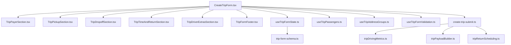

## Goal

Break down the 1700+ line `CreateTripForm` into composable TSX/TS modules that are easier to understand, test, and reuse across trip-related features, while keeping the overall behavior and workflow intact.

## High-level approach

- **Separate concerns** into UI sections, stateful hooks, and data/submit services.
- **Preserve behavior** by first extracting logic with minimal changes (same props, same side effects), then iterating.
- **Align with feature structure** by keeping everything inside `src/features/trips` and using TSX/TS files.

## Target architecture

- **UI components (presentational / low-logic)**
  - `create-trip-form.tsx` becomes a thin **orchestrator** that wires hooks + section components.
  - New section components in `src/features/trips/components/`:
    - `TripPayerSection.tsx` – contains the Kostenträger + Abrechnungsart block.
    - `TripPickupSection.tsx` – contains Abholung UI (anonymous vs passenger mode) and uses callbacks for state.
    - `TripDropoffSection.tsx` – contains Ziel UI, unassigned passengers panel, and uses callbacks for state.
    - `TripTimeAndReturnSection.tsx` – contains Zeit & Route, return-mode selector, and date/time inputs.
    - `TripDriverExtrasSection.tsx` – contains driver select, global wheelchair toggle (anonymous mode), and notes.
    - `TripFormFooter.tsx` – contains footer with passenger count and buttons.
  - These components receive **typed props** (TS interfaces) for all values and callbacks instead of using `useForm` or local `useState` directly.
- **Hooks (state + derived behavior)**
  - New hooks in `src/features/trips/hooks/`:
    - `useTripFormState.ts` – wraps `useForm<TripFormValues>`, watches payer/billing/return_mode, and exposes:
      - `form`, `watchedPayerId`, `watchedBillingTypeId`, `watchedIsWheelchair`, `watchedReturnMode`, `watchedScheduledAt`.
      - `behavior` and booleans `isPickupLocked`, `isDropoffLocked`, `isReturnModeLocked`, `requirePassenger`.
      - effect handlers for preselected client and billing-type behavior application.
    - `useTripPassengers.ts` – manages passenger-related state and helpers currently in `CreateTripForm`:
      - `passengers`, `addPassenger`, `removePassenger`, `updatePassengerStation`, `updatePassengerWheelchair`.
      - `assignToDropoff`, `unassignFromDropoff`.
      - derived `unassignedPassengers`, `getPickupGroupPassengers`, `getDropoffGroupPassengers`.
    - `useTripAddressGroups.ts` – manages pickup/dropoff group arrays and address-change logic:
      - `pickupGroups`, `dropoffGroups`, `addPickupGroup`, `removePickupGroup`, `addDropoffGroup`, `removeDropoffGroup`.
      - `updatePickupAddress`, `updateDropoffAddress`, `handleManualAddressFieldChange`, `handleAddressChoice`.
    - `useTripFormValidation.ts` – optional, to encapsulate custom validation state (`formErrors`) and helper that runs the current block of custom checks and returns the `errors` object + `hasCustomError` flag.
- **Services / pure utilities**
  - New service modules in `src/features/trips/lib/` or `src/features/trips/api/`:
    - `tripDrivingMetrics.ts` – wraps `getDrivingMetrics`, `ensureGroupHasCoords`, and distance/duration calculation for outbound/return, exposing pure helpers that take the resolved groups.
    - `tripPayloadBuilder.ts` – functions that build the payloads for anonymous vs passenger mode, returning typed objects that match `tripsService.createTrip` expectations.
    - `tripReturnScheduling.ts` – pure function to compute `returnScheduledAt` from `return_mode`, `return_date`, `return_time`.
  - These modules are **pure TS** (no React), making them easy to test and reuse for other flows (e.g. recurring trips, bulk operations).

## Step-by-step refactor outline

1. **Extract schema/types (no behavior change)**
  - Move `tripFormSchema`, `TripFormValues`, and `ReturnMode` into `src/features/trips/lib/trip-form-schema.ts`.
  - Update `create-trip-form.tsx` to import these instead of defining inline.
  - Confirm inferred types remain the same.
2. **Extract submit logic into a service**
  - Create `src/features/trips/lib/create-trip-submit.ts` with a function like `createTripsFromForm(values, context)`.
  - Move everything from `handleSubmit` into this function, parameterizing:
    - `values: TripFormValues`.
    - `passengers`, `pickupGroups`, `dropoffGroups`, `requirePassenger`, `behavior`, and `supabase` client.
    - Callbacks: `onSuccess`, error handling (return error instead of calling `toast` directly, or keep `toast` inside but isolated).
  - In `CreateTripForm`, `handleSubmit` becomes a thin wrapper:
    - Runs custom client-side validation (possibly via `useTripFormValidation`).
    - Calls `createTripsFromForm` and handles loading state.
  - This makes business logic reusable for other entry points (e.g. another form/wizard).
3. **Introduce hooks for form/behavior state**
  - Implement `useTripFormState`:
    - Encapsulate the `useForm` initialization and `watch` calls.
    - Move the billing behavior `useEffect`s (reset billing type, apply behavior profile, initialize return date) into this hook.
    - Return the same `behavior` object and booleans currently derived in the component.
  - Replace the in-component state/logic with a single call:
    - `const { form, behavior, isPickupLocked, isDropoffLocked, isReturnModeLocked, requirePassenger, watched... } = useTripFormState({ preselectedClientId, onClientSelect });`
4. **Introduce hooks for passengers and address groups**
  - Implement `useTripPassengers` and move all passenger-related `useState` + helper callbacks there.
  - Implement `useTripAddressGroups` and move all pickup/dropoff group arrays, add/remove, update functions, address choice and manual-change logic.
  - `CreateTripForm` now reads:
    - `const { passengers, addPassenger, ... } = useTripPassengers(...);`
    - `const { pickupGroups, dropoffGroups, updatePickupAddress, ... } = useTripAddressGroups({ behavior });`
  - Ensure hooks expose only what the UI needs and that internal data types are well-typed.
5. **Extract validation state to a small helper/hook**
  - Create `useTripFormValidation` or a pure function in `trip-form-validation.ts`:
    - Input: `values`, `requirePassenger`, `passengers`, `pickupGroups`, `dropoffGroups`.
    - Output: `{ errors, hasCustomError }` with the same shape as current `formErrors`.
  - Keep `formErrors` state in `CreateTripForm` initially, but call this helper to compute errors; then set state and early-return.
  - Optionally, move `formErrors` state into `useTripFormValidation` if that fits your style.
6. **Split UI into section components**
  - For each visual block (Kostenträger, Abholung, Ziel, Zeit & Route, Fahrer & Extras, Footer):
    - Create a TSX component with explicit props for:
      - Relevant `form` fields and `control`/`watch`ed values.
      - Derived flags (`requirePassenger`, `isPickupLocked`, `formErrors`, etc.).
      - Callbacks from hooks (`addPickupGroup`, `assignToDropoff`, etc.).
    - Move the JSX and **only minimal mapping glue** (no direct `useForm` calls) into these components.
  - Example (conceptual):
    - `TripPayerSection` gets `form`, `payers`, `billingTypes`, `selectedBillingType`, `isLoading`.
    - `TripPickupSection` gets `requirePassenger`, `pickupGroups`, passenger callbacks, and `formErrors.pickupGroups`.
    - `TripDropoffSection` gets `requirePassenger`, `dropoffGroups`, `unassignedPassengers`, assignment callbacks, and `formErrors.dropoffGroups`.
    - `TripTimeAndReturnSection` gets `form`, `watchedReturnMode`, `isReturnModeLocked`, `isSubmitting`, `hasInitializedReturnDateRef` handler.
    - `TripDriverExtrasSection` gets `form`, `drivers`, `watchedIsWheelchair`, `requirePassenger`.
    - `TripFormFooter` gets `isSubmitting`, `onCancel`, `passengers.length`.
7. **Simplify `CreateTripForm` orchestration**
  - After extraction, `CreateTripForm` should look roughly like:

```tsx
// High-level sketch, not exact code
export function CreateTripForm(props: CreateTripFormProps) {
  const { form, behavior, ...watched } = useTripFormState(props);
  const passengersState = useTripPassengers();
  const addressGroupsState = useTripAddressGroups({ behavior });
  const { errors, setErrors, validate } = useTripFormValidation();

  const handleSubmit = async (values: TripFormValues) => {
    if (!validate(values, passengersState, addressGroupsState)) return;
    await createTripsFromForm(values, { ...passengersState, ...addressGroupsState, behavior, ... });
  };

  return (
    <Form form={form} onSubmit={form.handleSubmit(handleSubmit)}>
      <TripPayerSection ... />
      <Separator />
      <TripPickupSection ... />
      <Separator />
      <TripDropoffSection ... />
      <Separator />
      <TripTimeAndReturnSection ... />
      <Separator />
      <TripDriverExtrasSection ... />
      <TripFormFooter ... />
    </Form>
  );
}
```

- This keeps the top-level file small, readable, and focused on wiring.

1. **Optional: introduce a higher-level wizard or layout tweaks**
  - Since you are open to moderate layout changes, we can:
    - Wrap sections into a **stepper or wizard** (e.g. Payer → Pickup → Dropoff → Time → Driver/Extras) without changing which fields exist.
    - Or add internal accordions/collapsible panels for advanced options (e.g. return trip details, notes) using existing shadcn components.
  - This can be a second phase after the structural refactor so that behavior stays stable first.
2. **Verify behavior and types**
  - Manually test the current critical paths:
    - Anonymous trip creation (with and without return trips, with/without coordinates).
    - Passenger mode with multiple passengers, multiple pickup/dropoff groups, and wheelchair flags.
    - Different billing types and behavior profiles (return policy, address defaults, locks).
  - Use TypeScript to ensure that extracted hooks and services keep strict types, avoiding `any`.

## Mermaid overview




