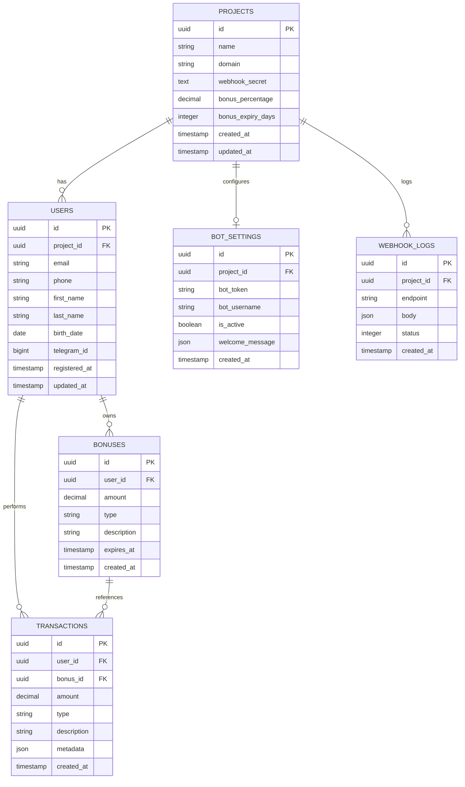

# 📊 Database Schema - Схема базы данных

Подробная документация схемы PostgreSQL базы данных для SaaS Bonus System.

## 🏗️ Обзор архитектуры

База данных спроектирована по принципу **мультитенантности** - каждый клиент (проект) изолирован через `projectId`, но использует общую схему. Это обеспечивает масштабируемость и простоту управления.

### 🎯 Основные принципы:
- **Мультитенантность**: Изоляция данных по `projectId`
- **Референциальная целостность**: Каскадные удаления и ограничения
- **Производительность**: Правильные индексы и типы данных
- **Аудит**: Временные метки для всех сущностей
- **Гибкость**: JSON поля для расширяемости

---

## 📋 Таблицы и структура

### 🏢 Projects (Проекты/Тенанты)

Основная таблица для мультитенантности. Каждая запись представляет отдельного клиента системы.

```sql
CREATE TABLE projects (
    id                  TEXT PRIMARY KEY DEFAULT gen_random_uuid(),
    name                TEXT NOT NULL,
    domain              TEXT UNIQUE,
    webhook_secret      TEXT NOT NULL UNIQUE DEFAULT gen_random_uuid(),
    bonus_percentage    DECIMAL(5,2) NOT NULL DEFAULT 1.0,
    bonus_expiry_days   INTEGER NOT NULL DEFAULT 365,
    is_active           BOOLEAN NOT NULL DEFAULT true,
    created_at          TIMESTAMP NOT NULL DEFAULT now(),
    updated_at          TIMESTAMP NOT NULL DEFAULT now()
);
```

#### Поля:
| Поле | Тип | Описание | Ограничения |
|------|-----|----------|-------------|
| `id` | TEXT | Уникальный идентификатор проекта | PK, UUID |
| `name` | TEXT | Название проекта | NOT NULL |
| `domain` | TEXT | Домен сайта клиента | UNIQUE, опционально |
| `webhook_secret` | TEXT | Секретный ключ для webhook | UNIQUE, автогенерация |
| `bonus_percentage` | DECIMAL(5,2) | Процент начисления бонусов | По умолчанию 1.0% |
| `bonus_expiry_days` | INTEGER | Срок действия бонусов в днях | По умолчанию 365 |
| `is_active` | BOOLEAN | Активность проекта | По умолчанию true |
| `created_at` | TIMESTAMP | Дата создания | Автозаполнение |
| `updated_at` | TIMESTAMP | Дата обновления | Автообновление |

#### Индексы:
```sql
CREATE INDEX idx_projects_domain ON projects(domain);
CREATE INDEX idx_projects_webhook_secret ON projects(webhook_secret);
CREATE INDEX idx_projects_active ON projects(is_active) WHERE is_active = true;
```

---

### 🤖 Bot Settings (Настройки ботов)

Настройки Telegram ботов для каждого проекта. Связь 1:1 с проектами.

```sql
CREATE TABLE bot_settings (
    id                  TEXT PRIMARY KEY DEFAULT gen_random_uuid(),
    project_id          TEXT NOT NULL UNIQUE,
    bot_token           TEXT NOT NULL,
    bot_username        TEXT NOT NULL,
    is_active           BOOLEAN NOT NULL DEFAULT true,
    welcome_message     JSON DEFAULT '{"text": "Добро пожаловать! Отправьте свой номер телефона для привязки аккаунта."}',
    created_at          TIMESTAMP NOT NULL DEFAULT now(),
    updated_at          TIMESTAMP NOT NULL DEFAULT now(),
    
    FOREIGN KEY (project_id) REFERENCES projects(id) ON DELETE CASCADE
);
```

#### Поля:
| Поле | Тип | Описание | Ограничения |
|------|-----|----------|-------------|
| `id` | TEXT | Уникальный идентификатор | PK, UUID |
| `project_id` | TEXT | ID проекта | FK → projects.id, UNIQUE |
| `bot_token` | TEXT | Токен Telegram бота | NOT NULL |
| `bot_username` | TEXT | Username бота в Telegram | NOT NULL |
| `is_active` | BOOLEAN | Активность бота | По умолчанию true |
| `welcome_message` | JSON | Настройки приветственного сообщения | JSON объект |

#### Пример welcome_message:
```json
{
  "text": "🎉 Добро пожаловать в бонусную программу {shopName}!",
  "variables": ["shopName"],
  "buttons": [
    {
      "text": "📞 Отправить номер телефона",
      "requestContact": true
    }
  ]
}
```

---

### 👥 Users (Пользователи)

Пользователи системы, привязанные к проектам. Поддерживает идентификацию по email/телефону и связь с Telegram.

```sql
CREATE TABLE users (
    id                  TEXT PRIMARY KEY DEFAULT gen_random_uuid(),
    project_id          TEXT NOT NULL,
    email               TEXT,
    phone               TEXT,
    first_name          TEXT,
    last_name           TEXT,
    birth_date          DATE,
    telegram_id         BIGINT UNIQUE,
    telegram_username   TEXT,
    is_active           BOOLEAN NOT NULL DEFAULT true,
    registered_at       TIMESTAMP NOT NULL DEFAULT now(),
    updated_at          TIMESTAMP NOT NULL DEFAULT now(),
    
    FOREIGN KEY (project_id) REFERENCES projects(id) ON DELETE CASCADE,
    
    -- Обеспечиваем уникальность email и phone в рамках проекта
    UNIQUE(project_id, email),
    UNIQUE(project_id, phone),
    
    -- Хотя бы одно из полей должно быть заполнено
    CONSTRAINT check_contact_info CHECK (
        email IS NOT NULL OR phone IS NOT NULL
    )
);
```

#### Поля:
| Поле | Тип | Описание | Ограничения |
|------|-----|----------|-------------|
| `id` | TEXT | Уникальный идентификатор | PK, UUID |
| `project_id` | TEXT | ID проекта | FK → projects.id |
| `email` | TEXT | Email пользователя | UNIQUE в проекте |
| `phone` | TEXT | Номер телефона | UNIQUE в проекте |
| `first_name` | TEXT | Имя | Опционально |
| `last_name` | TEXT | Фамилия | Опционально |
| `birth_date` | DATE | Дата рождения | Опционально |
| `telegram_id` | BIGINT | ID в Telegram | UNIQUE глобально |
| `telegram_username` | TEXT | Username в Telegram | Опционально |

#### Индексы:
```sql
CREATE INDEX idx_users_project_id ON users(project_id);
CREATE INDEX idx_users_email ON users(project_id, email) WHERE email IS NOT NULL;
CREATE INDEX idx_users_phone ON users(project_id, phone) WHERE phone IS NOT NULL;
CREATE INDEX idx_users_telegram_id ON users(telegram_id) WHERE telegram_id IS NOT NULL;
CREATE INDEX idx_users_birth_date ON users(project_id, birth_date) WHERE birth_date IS NOT NULL;
```

---

### 💰 Bonuses (Бонусы)

Начисленные бонусы пользователей с поддержкой истечения срока действия.

```sql
CREATE TABLE bonuses (
    id                  TEXT PRIMARY KEY DEFAULT gen_random_uuid(),
    user_id             TEXT NOT NULL,
    amount              DECIMAL(10,2) NOT NULL CHECK (amount > 0),
    type                bonus_type NOT NULL DEFAULT 'MANUAL',
    description         TEXT,
    expires_at          TIMESTAMP,
    is_used             BOOLEAN NOT NULL DEFAULT false,
    created_at          TIMESTAMP NOT NULL DEFAULT now(),
    
    FOREIGN KEY (user_id) REFERENCES users(id) ON DELETE CASCADE
);

CREATE TYPE bonus_type AS ENUM (
    'PURCHASE',     -- За покупку
    'BIRTHDAY',     -- За день рождения  
    'MANUAL',       -- Ручное начисление админом
    'REFERRAL',     -- За реферальную программу
    'PROMO'         -- За промокод
);
```

#### Поля:
| Поле | Тип | Описание | Ограничения |
|------|-----|----------|-------------|
| `id` | TEXT | Уникальный идентификатор | PK, UUID |
| `user_id` | TEXT | ID пользователя | FK → users.id |
| `amount` | DECIMAL(10,2) | Сумма бонусов | > 0 |
| `type` | ENUM | Тип начисления | См. bonus_type |
| `description` | TEXT | Описание начисления | Опционально |
| `expires_at` | TIMESTAMP | Дата истечения | Опционально |
| `is_used` | BOOLEAN | Использованы ли бонусы | По умолчанию false |

#### Индексы:
```sql
CREATE INDEX idx_bonuses_user_id ON bonuses(user_id);
CREATE INDEX idx_bonuses_expires_at ON bonuses(expires_at) WHERE expires_at IS NOT NULL;
CREATE INDEX idx_bonuses_active ON bonuses(user_id, is_used) WHERE is_used = false;
CREATE INDEX idx_bonuses_type ON bonuses(type);
```

---

### 💸 Transactions (Транзакции)

История всех операций с бонусами для аудита и аналитики.

```sql
CREATE TABLE transactions (
    id                  TEXT PRIMARY KEY DEFAULT gen_random_uuid(),
    user_id             TEXT NOT NULL,
    bonus_id            TEXT,
    amount              DECIMAL(10,2) NOT NULL CHECK (amount > 0),
    type                transaction_type NOT NULL,
    description         TEXT,
    metadata            JSON,
    created_at          TIMESTAMP NOT NULL DEFAULT now(),
    
    FOREIGN KEY (user_id) REFERENCES users(id) ON DELETE CASCADE,
    FOREIGN KEY (bonus_id) REFERENCES bonuses(id) ON DELETE SET NULL
);

CREATE TYPE transaction_type AS ENUM (
    'EARN',         -- Начисление
    'SPEND',        -- Списание
    'EXPIRE',       -- Истечение срока
    'REFUND'        -- Возврат
);
```

#### Поля:
| Поле | Тип | Описание | Ограничения |
|------|-----|----------|-------------|
| `id` | TEXT | Уникальный идентификатор | PK, UUID |
| `user_id` | TEXT | ID пользователя | FK → users.id |
| `bonus_id` | TEXT | ID связанного бонуса | FK → bonuses.id, NULL при удалении |
| `amount` | DECIMAL(10,2) | Сумма операции | > 0 |
| `type` | ENUM | Тип операции | См. transaction_type |
| `description` | TEXT | Описание операции | Опционально |
| `metadata` | JSON | Дополнительные данные | JSON объект |

#### Пример metadata:
```json
{
  "orderId": "ORDER_123",
  "purchaseAmount": 1000,
  "bonusPercentage": 1.5,
  "source": "webhook"
}
```

#### Индексы:
```sql
CREATE INDEX idx_transactions_user_id ON transactions(user_id);
CREATE INDEX idx_transactions_created_at ON transactions(created_at);
CREATE INDEX idx_transactions_type ON transactions(type);
CREATE INDEX idx_transactions_bonus_id ON transactions(bonus_id) WHERE bonus_id IS NOT NULL;
```

---

### 📋 Webhook Logs (Логи вебхуков)

Логирование всех webhook запросов для мониторинга и отладки.

```sql
CREATE TABLE webhook_logs (
    id                  TEXT PRIMARY KEY DEFAULT gen_random_uuid(),
    project_id          TEXT NOT NULL,
    endpoint            TEXT NOT NULL,
    method              TEXT NOT NULL,
    headers             JSON,
    body                JSON,
    response            JSON,
    status              INTEGER NOT NULL,
    success             BOOLEAN NOT NULL,
    created_at          TIMESTAMP NOT NULL DEFAULT now(),
    
    FOREIGN KEY (project_id) REFERENCES projects(id) ON DELETE CASCADE
);
```

#### Поля:
| Поле | Тип | Описание | Ограничения |
|------|-----|----------|-------------|
| `id` | TEXT | Уникальный идентификатор | PK, UUID |
| `project_id` | TEXT | ID проекта | FK → projects.id |
| `endpoint` | TEXT | URL endpoint | NOT NULL |
| `method` | TEXT | HTTP метод | NOT NULL |
| `headers` | JSON | HTTP заголовки | JSON объект |
| `body` | JSON | Тело запроса | JSON объект |
| `response` | JSON | Ответ сервера | JSON объект |
| `status` | INTEGER | HTTP статус код | NOT NULL |
| `success` | BOOLEAN | Успешность запроса | NOT NULL |

#### Индексы:
```sql
CREATE INDEX idx_webhook_logs_project_id ON webhook_logs(project_id);
CREATE INDEX idx_webhook_logs_created_at ON webhook_logs(created_at);
CREATE INDEX idx_webhook_logs_status ON webhook_logs(status);
CREATE INDEX idx_webhook_logs_success ON webhook_logs(success);
```

---

## 🔗 Связи между таблицами

### Диаграмма связей:



### Каскадные действия:
- **Projects → Users**: `ON DELETE CASCADE`
- **Projects → Bot_Settings**: `ON DELETE CASCADE`
- **Projects → Webhook_Logs**: `ON DELETE CASCADE`
- **Users → Bonuses**: `ON DELETE CASCADE`
- **Users → Transactions**: `ON DELETE CASCADE`
- **Bonuses → Transactions**: `ON DELETE SET NULL`

---

## 📊 Производительность и оптимизация

### Основные индексы:

```sql
-- Проекты
CREATE INDEX idx_projects_active ON projects(is_active) WHERE is_active = true;
CREATE INDEX idx_projects_webhook_secret ON projects(webhook_secret);

-- Пользователи  
CREATE INDEX idx_users_project_email ON users(project_id, email) WHERE email IS NOT NULL;
CREATE INDEX idx_users_project_phone ON users(project_id, phone) WHERE phone IS NOT NULL;
CREATE INDEX idx_users_telegram_id ON users(telegram_id) WHERE telegram_id IS NOT NULL;

-- Бонусы
CREATE INDEX idx_bonuses_user_active ON bonuses(user_id, is_used) WHERE is_used = false;
CREATE INDEX idx_bonuses_expiring ON bonuses(expires_at) WHERE expires_at IS NOT NULL AND is_used = false;

-- Транзакции
CREATE INDEX idx_transactions_user_date ON transactions(user_id, created_at DESC);
CREATE INDEX idx_transactions_type_date ON transactions(type, created_at DESC);

-- Webhook логи (с автоочисткой старых данных)
CREATE INDEX idx_webhook_logs_project_date ON webhook_logs(project_id, created_at DESC);
```

### Составные индексы для аналитики:

```sql
-- Для статистики по проектам
CREATE INDEX idx_users_project_registered ON users(project_id, registered_at);
CREATE INDEX idx_bonuses_project_created ON bonuses(user_id, created_at) 
    INCLUDE (amount, type);
CREATE INDEX idx_transactions_project_stats ON transactions(user_id, type, created_at) 
    INCLUDE (amount);
```

---

## 🔄 Миграции и версионирование

### Prisma миграции:

```sql
-- Initial migration
-- CreateTable
CREATE TABLE "projects" (
    "id" TEXT NOT NULL,
    "name" TEXT NOT NULL,
    "domain" TEXT,
    "webhook_secret" TEXT NOT NULL,
    "bonus_percentage" DECIMAL(5,2) NOT NULL DEFAULT 1.0,
    "bonus_expiry_days" INTEGER NOT NULL DEFAULT 365,
    "is_active" BOOLEAN NOT NULL DEFAULT true,
    "created_at" TIMESTAMP(3) NOT NULL DEFAULT CURRENT_TIMESTAMP,
    "updated_at" TIMESTAMP(3) NOT NULL,

    CONSTRAINT "projects_pkey" PRIMARY KEY ("id")
);

-- CreateEnum
CREATE TYPE "BonusType" AS ENUM ('PURCHASE', 'BIRTHDAY', 'MANUAL', 'REFERRAL', 'PROMO');
CREATE TYPE "TransactionType" AS ENUM ('EARN', 'SPEND', 'EXPIRE', 'REFUND');
```

### Команды для управления миграциями:

```bash
# Создание новой миграции
npx prisma migrate dev --name add_feature

# Применение миграций в production
npx prisma migrate deploy

# Просмотр статуса миграций
npx prisma migrate status

# Откат миграции (только в dev)
npx prisma migrate reset
```

---

## 📈 Запросы для аналитики

### Получение статистики проекта:

```sql
-- Общая статистика проекта
SELECT 
    p.name as project_name,
    COUNT(DISTINCT u.id) as total_users,
    COUNT(DISTINCT CASE WHEN u.telegram_id IS NOT NULL THEN u.id END) as telegram_users,
    SUM(CASE WHEN b.is_used = false AND (b.expires_at IS NULL OR b.expires_at > NOW()) THEN b.amount ELSE 0 END) as active_bonuses,
    SUM(CASE WHEN t.type = 'EARN' THEN t.amount ELSE 0 END) as total_earned,
    SUM(CASE WHEN t.type = 'SPEND' THEN t.amount ELSE 0 END) as total_spent
FROM projects p
LEFT JOIN users u ON u.project_id = p.id
LEFT JOIN bonuses b ON b.user_id = u.id  
LEFT JOIN transactions t ON t.user_id = u.id
WHERE p.id = $1
GROUP BY p.id, p.name;
```

### Топ пользователей по бонусам:

```sql
-- Топ 10 пользователей по заработанным бонусам
SELECT 
    u.email,
    u.first_name,
    u.last_name,
    SUM(CASE WHEN t.type = 'EARN' THEN t.amount ELSE 0 END) as total_earned,
    SUM(CASE WHEN t.type = 'SPEND' THEN t.amount ELSE 0 END) as total_spent,
    SUM(CASE WHEN t.type = 'EARN' THEN t.amount ELSE -t.amount END) as current_balance
FROM users u
JOIN transactions t ON t.user_id = u.id
WHERE u.project_id = $1
GROUP BY u.id, u.email, u.first_name, u.last_name
ORDER BY total_earned DESC
LIMIT 10;
```

### Анализ истечения бонусов:

```sql
-- Бонусы, которые истекают в ближайшие 30 дней
SELECT 
    u.email,
    b.amount,
    b.expires_at,
    DATE_PART('day', b.expires_at - NOW()) as days_until_expiry
FROM bonuses b
JOIN users u ON u.id = b.user_id
WHERE u.project_id = $1
    AND b.is_used = false
    AND b.expires_at BETWEEN NOW() AND NOW() + INTERVAL '30 days'
ORDER BY b.expires_at ASC;
```

---

## 🛠️ Обслуживание БД

### Автоочистка старых данных:

```sql
-- Функция для очистки старых webhook логов (старше 90 дней)
CREATE OR REPLACE FUNCTION cleanup_old_webhook_logs()
RETURNS void AS $$
BEGIN
    DELETE FROM webhook_logs 
    WHERE created_at < NOW() - INTERVAL '90 days';
END;
$$ LANGUAGE plpgsql;

-- Настройка автозапуска через cron
SELECT cron.schedule('cleanup-webhook-logs', '0 2 * * *', 'SELECT cleanup_old_webhook_logs();');
```

### Бэкап и восстановление:

```bash
# Создание бэкапа
pg_dump -h localhost -U postgres -d bonus_saas > backup_$(date +%Y%m%d).sql

# Восстановление из бэкапа
psql -h localhost -U postgres -d bonus_saas_new < backup_20241231.sql

# Бэкап только схемы
pg_dump -s -h localhost -U postgres -d bonus_saas > schema_backup.sql
```

---

## 🔒 Безопасность

### Права доступа:

```sql
-- Создание ролей
CREATE ROLE app_read;
CREATE ROLE app_write;
CREATE ROLE app_admin;

-- Права на чтение
GRANT SELECT ON ALL TABLES IN SCHEMA public TO app_read;

-- Права на запись
GRANT SELECT, INSERT, UPDATE, DELETE ON ALL TABLES IN SCHEMA public TO app_write;

-- Административные права
GRANT ALL PRIVILEGES ON ALL TABLES IN SCHEMA public TO app_admin;
```

### Row Level Security (RLS):

```sql
-- Включение RLS для мультитенантности
ALTER TABLE users ENABLE ROW LEVEL SECURITY;
ALTER TABLE bonuses ENABLE ROW LEVEL SECURITY;
ALTER TABLE transactions ENABLE ROW LEVEL SECURITY;

-- Политика доступа к пользователям (пример)
CREATE POLICY user_project_policy ON users
    FOR ALL
    TO app_write
    USING (project_id = current_setting('app.current_project_id'));
```

---

**Версия схемы**: 1.0  
**Последнее обновление**: 2024-12-31  
**СУБД**: PostgreSQL 14+ 