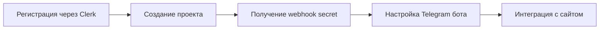
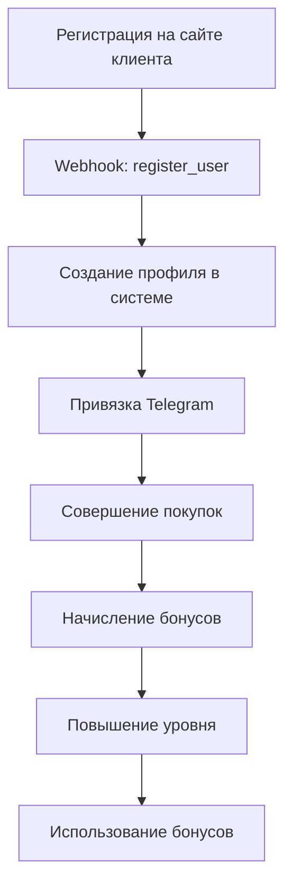

# 🔍 Анализ проекта SaaS Bonus System

## 📊 Основные бизнес-процессы

### 1. Регистрация и онбординг клиента (B2B)


### 2. Жизненный цикл пользователя (B2C)


### 3. Процесс начисления бонусов
```
1. Покупка на сайте клиента → 
2. Webhook запрос → 
3. Валидация данных → 
4. Расчет бонусов по уровню → 
5. Начисление с expiry date → 
6. Telegram уведомление → 
7. Обновление статистики
```

### 4. Реферальная система
```
Реферер делится ссылкой → 
Новый пользователь регистрируется → 
Совершает покупку → 
Реферер получает % от покупки → 
Оба получают уведомления
```

## 🛠️ Технологический стек

### ✅ **Правильно выбранные технологии:**

#### Frontend & Framework
- **Next.js 15** - отличный выбор для SaaS
  - ✅ SSR для SEO и быстрой загрузки
  - ✅ App Router для современной архитектуры
  - ✅ API Routes для backend
  - ✅ Turbopack для быстрой разработки

#### База данных
- **PostgreSQL + Prisma ORM**
  - ✅ Надежная реляционная БД
  - ✅ Типобезопасный ORM
  - ✅ Миграции и версионирование схемы
  - ✅ Поддержка транзакций для консистентности

#### Аутентификация
- **Clerk**
  - ✅ Готовое решение для auth
  - ✅ Поддержка мультитенантности
  - ✅ OAuth провайдеры
  - ✅ Безопасность из коробки

#### UI/UX
- **Shadcn/ui + Tailwind CSS**
  - ✅ Современные компоненты
  - ✅ Полная кастомизация
  - ✅ Отличная производительность
  - ✅ Accessibility из коробки

#### Telegram интеграция
- **Grammy Framework**
  - ✅ Лучший фреймворк для Telegram ботов
  - ✅ TypeScript поддержка
  - ✅ Middleware система
  - ✅ Хорошая документация

### ⚠️ **Спорные решения:**

1. **Отсутствие выделенного backend**
   - Вся логика в Next.js API routes
   - Может быть проблемой при масштабировании
   - Рекомендация: выделить микросервисы для тяжелых операций

2. **In-memory rate limiting**
   - Не работает в serverless/multi-instance
   - Решение: использовать Redis для rate limiting

3. **Синхронная обработка webhook**
   - Может быть медленной при большой нагрузке
   - Решение: очередь задач (Bull/BullMQ)

## 🚀 Будет ли проект работать?

### ✅ **ДА, проект будет работать!**

#### Сильные стороны:

1. **Архитектура**
   - ✅ Чистое разделение по features
   - ✅ Изоляция данных между тенантами
   - ✅ Транзакционность критических операций

2. **Безопасность**
   - ✅ JWT аутентификация
   - ✅ Валидация всех входных данных
   - ✅ Rate limiting
   - ✅ Защита от SQL инъекций

3. **Масштабируемость**
   - ✅ Stateless архитектура
   - ✅ Docker поддержка
   - ✅ Горизонтальное масштабирование возможно

4. **Надежность**
   - ✅ Обработка ошибок
   - ✅ Логирование
   - ✅ Мониторинг через Sentry
   - ✅ Тесты

## 📈 Оценка масштабируемости

### Текущие возможности:
- **~100-500 проектов** - без проблем
- **~10K-50K пользователей** - комфортно
- **~1000 запросов/мин** - справится

### Узкие места при росте:

1. **База данных**
   - При >100K пользователей нужен read replica
   - При >1M пользователей - шардинг по projectId

2. **Telegram боты**
   - Каждый бот = отдельный процесс
   - При >100 ботов нужен отдельный сервер

3. **Webhook обработка**
   - При >10K запросов/мин нужна очередь

## 🎯 Целевая аудитория

### Идеально подходит для:
1. **Малый и средний бизнес**
   - Интернет-магазины
   - Рестораны и кафе
   - Салоны красоты
   - Фитнес-клубы

2. **Стартапы**
   - Быстрый запуск программы лояльности
   - Минимальные затраты на разработку

3. **Маркетплейсы на Tilda**
   - Готовая интеграция
   - Простая настройка

## ⚠️ Риски и проблемы

### Технические риски:

1. **Производительность аналитики**
   - Тяжелые SQL запросы без кэширования
   - Решение: добавить Redis кэш

2. **Отсутствие очередей**
   - Все операции синхронные
   - Решение: Bull + Redis для фоновых задач

3. **Хранение больших объемов данных**
   - Нет архивации старых транзакций
   - Решение: партиционирование таблиц

### Бизнес риски:

1. **Конкуренция**
   - Много готовых решений (Mindbox, Loymax)
   - Нужна уникальная ценность

2. **Регулирование**
   - GDPR/152-ФЗ compliance нужно проверить
   - Хранение персональных данных

## 💡 Рекомендации по улучшению

### Срочно (для production):

1. **Добавить Redis**
```yaml
services:
  redis:
    image: redis:7-alpine
    volumes:
      - redis_data:/data
```

2. **Настроить очереди задач**
```typescript
// Bull queue для фоновых задач
import Bull from 'bull';

const bonusQueue = new Bull('bonus-processing', {
  redis: { port: 6379, host: 'redis' }
});
```

3. **Оптимизировать аналитику**
```typescript
// Добавить индексы
@@index([projectId, createdAt])
@@index([userId, type, createdAt])
```

### В ближайшее время:

1. **API Gateway**
   - Kong или Traefik для управления трафиком
   - Централизованный rate limiting

2. **Микросервисы**
   - Выделить Telegram ботов в отдельный сервис
   - Аналитику в отдельный сервис

3. **Мониторинг**
   - Prometheus + Grafana
   - APM (Application Performance Monitoring)

### Долгосрочно:

1. **Multi-region deployment**
   - CDN для статики
   - Geo-распределенные БД

2. **Machine Learning**
   - Предсказание оттока клиентов
   - Персонализация предложений

3. **Расширение функционала**
   - Push уведомления
   - Email маркетинг
   - Геймификация

## 📊 Итоговая оценка

| Критерий | Оценка | Комментарий |
|----------|--------|-------------|
| Архитектура | 8/10 | Хорошая, но нужны улучшения для scale |
| Технологии | 9/10 | Современный и правильный стек |
| Безопасность | 8/10 | Хорошая базовая защита |
| Масштабируемость | 7/10 | Готова для среднего бизнеса |
| Готовность к production | 8/10 | После minor fixes - готова |
| Бизнес-потенциал | 8/10 | Есть рынок и спрос |

## 🎯 Вывод

**Проект определенно будет работать и имеет хороший потенциал!**

Это качественное решение для малого и среднего бизнеса, которое может быстро выйти на рынок. С небольшими доработками (Redis, очереди, оптимизация) система сможет обслуживать сотни клиентов и десятки тысяч конечных пользователей.

Основное преимущество - **готовое решение с минимальным порогом входа** для бизнеса, которому нужна программа лояльности.

---
*Анализ подготовлен на основе изучения кодовой базы, архитектуры и бизнес-логики проекта*